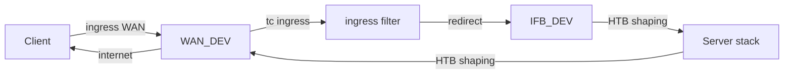

# АРХИТЕКТУРА

В этом документе описано, как проект **vff-qos** реализует per-user ограничение скорости
для VPN-нод на базе Xray с использованием примитивов ядра Linux:
`conntrack mark`, `nftables`, `tc`, `ifb` и небольшого userspace-фолловера.

> Цель: назначать лимиты скорости **на пользователя** (по email из Xray access log)
> и обеспечивать их соблюдение **на уровне ядра**, без proxy-level throttling.

---

## Общий поток данных

```mermaid
flowchart TD
  A["Xray access log<br/>email + src ip:port"] --> B["qos_follow_xray_email.sh<br/>tail -F + разбор accepted"]
  B --> C["Вычисление mark(email)<br/>стабильный 16-бит"]
  B --> D["conntrack -U<br/>установка ct mark для TCP-сессии"]
  D --> E[("conntrack table")]
  E --> F["nftables<br/>копирование ct mark → skb meta mark"]
  F --> G["tc filters (fw classifier)<br/>матч по skb mark"]
  G --> H1["Upload shaping<br/>WAN ingress → IFB egress<br/>HTB класс на mark"]
  G --> H2["Download shaping<br/>WAN egress<br/>HTB класс на mark"]
  H1 --> I["client → server ограничен"]
  H2 --> J["server → client ограничен"]
  ```

### Ключевые свойства

- **Источник идентификации** — Xray access log (email пользователя).
- **Назначение на уровне flow** — метка применяется к TCP-сессии целиком.
- **Принуждение на уровне ядра** — `tc` ограничивает трафик без участия приложения.

---

## Компоненты системы

### 1) `qos_follow_xray_email.sh` (runtime-фолловер)

Назначение:

1. Подписывается на Xray access log (`tail -F` внутри контейнера)
2. Извлекает `(email, src_ip, src_port)` для принятых соединений
3. Отображает `email → mark` (стабильный 16-бит)
4. Создаёт / обновляет HTB-классы и `fw`-фильтры
5. Обновляет `conntrack mark` для соответствующей TCP-сессии

Фолловер **идемпотентен**:
- классы создаются один раз и далее обновляются (`tc class change`)
- фильтры применяются через `tc filter replace`

---

### 2) conntrack mark — метка соединения

`ct mark` используется как **каноническая метка TCP-сессии**.

Почему это важно:

- хранится в ядре на протяжении всей жизни соединения
- доступна и в netfilter (`nftables`), и в `tc`
- исключает необходимость per-packet логики в userspace

Фолловер выполняет:

```
conntrack -U ... --mark <mark>
```

Метка назначается TCP-потоку с параметрами:

- `orig-src` — IP клиента
- `orig-dst` — IP сервера
- `orig-port-src` — порт клиента
- `orig-port-dst` — VPN-порт (например, 443)

---

### 3) nftables: перенос ct mark → skb mark

`tc` с классификатором `fw` работает **только со skb mark**
(`meta mark`), а не напрямую с conntrack mark.

Поэтому требуется kernel-side шаг копирования.

Используется include-модель:

- `/etc/nftables.conf` содержит:
  ```
  include "/etc/nftables.d/*.nft"
  ```
- `vff-qos` устанавливает файл:
  ```
  /etc/nftables.d/20-vff-qos-ctmark.nft
  ```

Поведение:

- `prerouting`: `meta mark set ct mark`
- `output`: `meta mark set ct mark`

Таким образом:
- входящий трафик,
- исходящий локальный трафик

получают skb mark, совпадающий с `ct mark` соединения.

#### Почему include-модель (а не замена `/etc/nftables.conf`)

- `/etc/nftables.conf` обычно уже управляется системой/другими ролями
- перезапись файла сломает существующие firewall-правила
- include позволяет независимым компонентам добавлять правила безопасно
- удаление QoS = удаление одного snippet-файла

Это соответствует идеологии **модульной инфраструктуры**.

---

### 4) tc + IFB: ограничение upload и download

Ограничиваются **две разные стороны** трафика:

- **Download (server → client)** — egress shaping на WAN-интерфейсе
- **Upload (client → server)** — ingress невозможно шейпить напрямую,
  поэтому трафик перенаправляется в IFB и шейпится как egress



---

## Почему `action ctinfo cpmark` критичен

При перенаправлении ingress-пакетов с `WAN_DEV` в `IFB_DEV`
необходимо, чтобы **skb mark был установлен корректно**.

Ingress-фильтр использует:

```
action ctinfo cpmark
action mirred egress redirect dev IFB_DEV
```

### Что делает `ctinfo cpmark`

Он копирует метку соединения в пакет:

```
skb->mark = ct->mark
```

Это гарантирует, что:
- после redirect в IFB,
- `tc filter fw` сможет корректно сопоставить пакет с HTB-классом пользователя.

Без этого шага возможны симптомы:

- трафик попадает в default-класс
- per-user лимиты работают нестабильно
- проблемы проявляются именно под нагрузкой

> Важно: nftables copy (`ct mark → meta mark`) остаётся необходимым
> для egress и локального output-трафика.
> `ctinfo cpmark` и nftables **дополняют**, а не заменяют друг друга.

---

## Резюме data plane

- Фолловер назначает `ct mark` TCP-сессиям.
- nftables и ingress-фильтр обеспечивают перенос метки в skb.
- `tc` применяет HTB-ограничения по skb mark.
- Upload и download шейпятся независимо.

---

## Эксплуатационные заметки

- WAN-интерфейс может определяться автоматически (`qos_if_wan=auto`).
- Управление жизненным циклом через `qos_state`:
  - `present` — включить QoS
  - `disabled` — kill switch (без удаления конфигурации)
  - `absent` — полный демонтаж и откат tc/nft (опционально)

---

## Связанные файлы

- Ansible-роль: `ansible/roles/qos_per_user_xray/`
- nftables snippet: `templates/nftables-include-qos-ctmark.nft.j2`
- Bootstrap-скрипт: `files/qos_bootstrap_tc.sh`
- Фолловер: `files/qos_follow_xray_email.sh`
